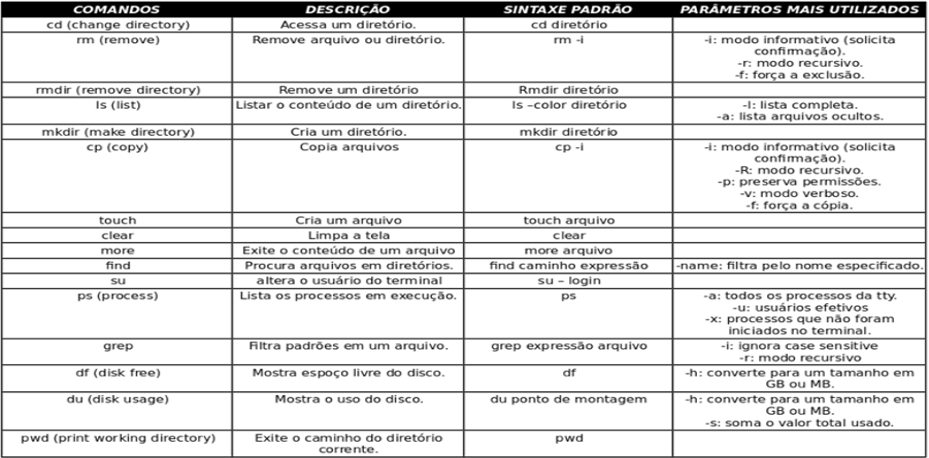

---?image=img/dtp.jpg

<div style="float:right; margin:-45px; padding:0; font-family:Helvetica Neue; font-size:120%; font-weight:bold; color:white">REPASSE DE CONHECIMENTO</div><br>
<span style="float:right; margin:-45px; padding:0; font-family:Helvetica Neue; font-weight:bold; color:white">REDHAT</span>

---?image=img/dtp_capitulo.jpg

<div style="float:center; font-family:Helvetica Neue; font-size:180%; font-weight:bold; color:#2E86AC">VIRTUALIZAÇÃO</div><br>

+++?image=img/dtp_fundo.jpg

<span style="color:#035D93; font-size:1.5em">Tradicional X Virtual </b></span>


+++?image=img/dtp_fundo.jpg

<span style="color:#035D93; font-size:1.5em">Hypervisor </b></span>


+++?image=img/dtp_fundo.jpg

<span style="color:#035D93; font-size:1.5em">Ganho$ </b></span>


---?image=img/dtp_capitulo.jpg

<div style="float:center; font-family:Helvetica Neue; font-size:180%; font-weight:bold; color:#2E86AC">VAGRANT</div><br>

+++?image=img/dtp_fundo.jpg

<span style="color:#035D93; font-size:1.5em">O que é?</b></span>


+++?image=img/dtp_fundo.jpg

<span style="color:#035D93; font-size:1.5em">Como funciona?</b></span>


+++?image=img/dtp_fundo.jpg

<span style="color:#035D93; font-size:1.5em">Vagrantfile</b></span>

```Ruby
# -*- mode: ruby -*-
# vi: set ft=ruby :
Vagrant.configure("2") do |config|
  config.vm.define "centos7" , primary: true do |centos7|
    centos7.vm.synced_folder ".", "/vagrant", disabled: true
    centos7.vm.box = "centos/7"
    centos7.vm.network "private_network", ip: "192.168.33.85"
    centos7.vm.hostname = "centos7.dtp" 
    centos7.vm.provider "virtualbox" do |vb|
      vb.memory = 1024
      vb.cpus = 2
      end
   end  
end
```

+++?image=img/dtp_fundo.jpg

<span style="color:#035D93; font-size:1.5em">vagrant up</b></span>


---?image=img/dtp_capitulo.jpg

<div style="float:center; font-family:Helvetica Neue; font-size:180%; font-weight:bold; color:#2E86AC">FAMÍLIA REDHAT</div><br>

+++?image=img/dtp_fundo.jpg

<span style="color:#035D93; font-size:1.5em">Fedora x Redhat x CentOS </b></span>


---?image=img/dtp_capitulo.jpg

<div style="float:center; font-family:Helvetica Neue; font-size:180%; font-weight:bold; color:#2E86AC">FERRAMENTAS ESSENCIAIS</div><br>

+++?image=img/dtp_fundo.jpg

<span style="color:#035D93; font-size:1.5em">Entrada, Saída e Erro padrão</b></span>

|*Nome*|*Destino*|*Redireciona*|*Número Descritor*|
|---|---|---|---|
|STDIN|Teclado|< ou 0<|0|
|STDOUT|Monitor|> ou 1>|1|
|STDERR|Monitor|2>|2|

+++?image=img/dtp_fundo.jpg

<span style="color:#035D93; font-size:1.5em">Comandos Básicos</b></span>



---?image=img/dtp_capitulo.jpg

<div style="float:center; font-family:Helvetica Neue; font-size:180%; font-weight:bold; color:#2E86AC">SISTEMAS EM EXECUÇÃO</div><br>

+++?image=img/dtp_fundo.jpg

<span style="color:#035D93; font-size:1.5em">Systemd</b></span>


+++?image=img/dtp_fundo.jpg

<span style="color:#035D93; font-size:1.5em">Runlevels / Target</b></span>


---?image=img/dtp_capitulo.jpg

<div style="float:center; font-family:Helvetica Neue; font-size:180%; font-weight:bold; color:#2E86AC">SISTEMAS DE ARQUIVOS</div><br>

+++?image=img/dtp_fundo.jpg

<span style="color:#035D93; font-size:1.5em">Definição</b></span>


+++?image=img/dtp_fundo.jpg

<span style="color:#035D93; font-size:1.5em">Tipos</b></span>


---?image=img/dtp_capitulo.jpg

<div style="float:center; font-family:Helvetica Neue; font-size:180%; font-weight:bold; color:#2E86AC">USUÁRIOS E GRUPOS</div><br>

+++?image=img/dtp_fundo.jpg

<span style="color:#035D93; font-size:1.5em">Usuários</b></span>

* Usuários
* Superusuários
* sudo **x** su
```Linux
cat /etc/passwd
root:x:0:0:root:/root:/bin/bash
sshd:x:74:74:Privilege-separated SSH:/var/empty/sshd:/sbin/nologin
vagrant:x:1000:1000:vagrant:/home/vagrant:/bin/bash
vboxadd:x:996:1::/var/run/vboxadd:/bin/false
```


+++?image=img/dtp_fundo.jpg

<span style="color:#035D93; font-size:1.5em">Grupos</b></span>

* Grupos primários
* Grupps secundários
* Permissões UGO
```Linux


---

## Code Slides
<span style="font-size:0.6em; color:gray">Press Down key for examples.</span> |
<span style="font-size:0.6em; color:gray">See <a href="https://github.com/gitpitch/gitpitch/wiki/Code-Slides" target="_blank">GitPitch Wiki</a> for details.</span>

+++

#### Use Markdown Code Blocks

<br>

And enjoy code syntax highlighting for dozens of languages powered by <a target="_blank" href="highlight.js](https://highlightjs.org">highlight.js</a>.

+++

```JavaScript
// JavaScript Code Block

$('button').click(function(){
    $('h1, h2, p').addClass('blue')
    $('div').removeClass('important')
    $('h3').toggleClass('error')
    $('#foo').attr('alt', 'Lorem Ipsum')
});
```

+++

```Scala
// Scala Code Block

HashMap params = HashMap(n -> 10, mean -> 5)

// Define executable for R stats#rnorm function call.
OCPUTask task = OCPU.R()
                    .pkg("stats")
                    .function("rnorm")
                    .input(params.asJava)
                    .library()
```

+++

```Go
// Go Code Block

package main

import "fmt"

func swap(x, y string) (string, string) {
    return y, x
}

func main() {
    a, b := swap("hello", "world")
    fmt.Println(a, b)
}
```

---

## GIST Slides
<span style="font-size:0.6em; color:gray">Press Down key for examples.</span> |
<span style="font-size:0.6em; color:gray">See <a href="https://github.com/gitpitch/gitpitch/wiki/GIST-Slides" target="_blank">GitPitch Wiki</a> for details.</span>

+++

#### GitHub GIST
#### Building Blocks For Any Presentation

<br>

Enjoy 100% reusable code snippets, excellent syntax highlighting, code indentation and styling. 

+++?gist=8da53731fd54bab9d5c6

+++?gist=28ee3d19ddef9d51b15adbdfe9ed48da

---

## Image Slides
## [ Inline ]
<span style="font-size:0.6em; color:gray">Press Down key for examples.</span> |
<span style="font-size:0.6em; color:gray">See <a href="https://github.com/gitpitch/gitpitch/wiki/Image-Slides" target="_blank">GitPitch Wiki</a> for details.</span>

+++

#### Make A Visual Statement

<br>

Use inline images to lend a *visual punch* to your slideshow presentations.


+++

<span style="color:gray; font-size:0.7em">Inline Image at <b>Absolute URL</b></span>


<span style="color:gray; font-size: 0.5em;">the <b>Private Investocat</b> by <a href="https://github.com/jeejkang" target="_blank">jeejkang</a></span>


+++

<span style="color:gray; font-size:0.7em">Inline Image at GitHub Repo <b>Relative URL</b></span>


<span style="color:gray; font-size:0.5em">the <b>Octocat-De-Los-Muertos</b> by <a href="https://github.com/cameronmcefee" target="_blank">cameronmcefee</a></span>


+++

<span style="color:gray; font-size:0.7em"><b>Animated GIFs</b> Work Too!</span>


<span style="color:gray; font-size:0.5em">the <b>Daftpunktocat-Guy</b> by <a href="https://github.com/jeejkang" target="_blank">jeejkang</a></span>

---

## Image Slides
## [ Background ]
<span style="font-size:0.6em; color:gray">Press Down key for examples.</span> |
<span style="font-size:0.6em; color:gray">See <a href="https://github.com/gitpitch/gitpitch/wiki/Image-Slides#background" target="_blank">GitPitch Wiki</a> for details.</span>

+++

#### Make A Bold Visual Statement

<br>

Use high-resolution background images for maximum impact.

+++?image=https://d1z75bzl1vljy2.cloudfront.net/kitchen-sink/victory.jpg

+++?image=https://d1z75bzl1vljy2.cloudfront.net/kitchen-sink/127.jpg


---

## Video Slides
## [ Inline ]
<span style="font-size:0.6em; color:gray">Press Down key for examples.</span> |
<span style="font-size:0.6em; color:gray">See <a href="https://github.com/gitpitch/gitpitch/wiki/Video-Slides" target="_blank">GitPitch Wiki</a> for details.</span>

+++

#### Bring Your Presentations Alive

<br>

Embed *YouTube*, *Vimeo*, *MP4* and *WebM* inline on any slide.

+++


+++


+++


---

## Video Slides
## [ Background ]
<span style="font-size:0.6em; color:gray">Press Down key for examples.</span> |
<span style="font-size:0.6em; color:gray">See <a href="https://github.com/gitpitch/gitpitch/wiki/Video-Slides#background" target="_blank">GitPitch Wiki</a> for details.</span>

+++

#### Maximize The Viewer Experience

<br>

Go fullscreen with *MP4* and *WebM* videos.

+++?video=http://clips.vorwaerts-gmbh.de/big_buck_bunny.mp4

---

## Math Notation Slides
<span style="font-size:0.6em; color:gray">Press Down key for examples.</span> |
<span style="font-size:0.6em; color:gray">See <a href="https://github.com/gitpitch/gitpitch/wiki/Math-Notation-Slides" target="_blank">GitPitch Wiki</a> for details.</span>

+++


#### Beautiful Math Rendered Beautifully

<br>

Use *TeX*, *LaTeX* and *MathML* markup powered by <a target="_blank" href="https://www.mathjax.org/">MathJax</a>.

+++

`$$\sum_{i=0}^n i^2 = \frac{(n^2+n)(2n+1)}{6}$$`

+++

`\begin{align}
\dot{x} & = \sigma(y-x) \\
\dot{y} & = \rho x - y - xz \\
\dot{z} & = -\beta z + xy
\end{align}`

+++

##### The Cauchy-Schwarz Inequality

`\[
\left( \sum_{k=1}^n a_k b_k \right)^{\!\!2} \leq
 \left( \sum_{k=1}^n a_k^2 \right) \left( \sum_{k=1}^n b_k^2 \right)
\]`

+++

##### The probability of getting \(k\) heads when flipping \(n\) coins is:

`\[P(E) = {n \choose k} p^k (1-p)^{ n-k} \]`

+++

##### In-line Mathematics

This expression `\(\sqrt{3x-1}+(1+x)^2\)` is an example of an inline equation.

---

## Slide Fragments
<span style="font-size:0.6em; color:gray">Press Down key for examples.</span> |
<span style="font-size:0.6em; color:gray">See <a href="https://github.com/gitpitch/gitpitch/wiki/Fragment-Slides" target="_blank">GitPitch Wiki</a> for details.</span>

+++

#### Reveal Slide Concepts Piecemeal

<br>

Step through slide content in sequence to slowly reveal the bigger picture.

+++

- Java
- Groovy |
- Kotlin |
- Scala  |
- The JVM rocks! |

+++

<table>
  <tr>
    <th>Firstname</th>
    <th>Lastname</th> 
    <th>Age</th>
  </tr>
  <tr>
    <td>Jill</td>
    <td>Smith</td>
    <td>25</td>
  </tr>
  <tr class="fragment">
    <td>Eve</td>
    <td>Jackson</td>
    <td>94</td>
  </tr>
  <tr class="fragment">
    <td>John</td>
    <td>Doe</td>
    <td>43</td>
  </tr>
</table>

---
## <span style="text-transform: none">PITCHME.yaml</span> Settings
<span style="font-size:0.6em; color:gray">Press Down key for examples.</span> |
<span style="font-size:0.6em; color:gray">See <a href="https://github.com/gitpitch/gitpitch/wiki/Slideshow-Settings" target="_blank">GitPitch Wiki</a> for details.</span>

+++

#### Stamp Your Own Look and Feel

<br>

Set a default theme, custom logo, custom css, background image, and preferred code syntax highlighting style.

+++

#### Customize Slideshow Behavior

<br>

Enable auto-slide with custom slide intervals, presentation looping, and RTL flow.


---
## Slideshow Keyboard Controls
<span style="font-size:0.6em; color:gray">Press Down key for examples.</span> |
<span style="font-size:0.6em; color:gray">See <a href="https://github.com/gitpitch/gitpitch/wiki/Slideshow-Fullscreen-Mode" target="_blank">GitPitch Wiki</a> for details.</span>

+++

#### Try Out These Great Features Now!

<br>

| Mode | On Key | Off Key |
| ---- | :------: | :--------: |
| Fullscreen | F |  Esc |
| Overview | O |  O |
| Blackout | B |  B |
| Help | ? |  Esc |


---

## GitPitch Social
<span style="font-size:0.6em; color:gray">Press Down key for examples.</span> |
<span style="font-size:0.6em; color:gray">See <a href="https://github.com/gitpitch/gitpitch/wiki/Slideshow-GitHub-Badge" target="_blank">GitPitch Wiki</a> for details.</span>

+++

#### Slideshows Designed For Sharing

<br>

- View any slideshow at its public URL
- [Promote](https://github.com/gitpitch/gitpitch/wiki/Slideshow-GitHub-Badge) any slideshow using a GitHub badge
- [Embed](https://github.com/gitpitch/gitpitch/wiki/Slideshow-Embedding) any slideshow within a blog or website
- [Share](https://github.com/gitpitch/gitpitch/wiki/Slideshow-Sharing) any slideshow on Twitter, LinkedIn, etc
- [Print](https://github.com/gitpitch/gitpitch/wiki/Slideshow-Printing) any slideshow as a PDF document
- [Download and present](https://github.com/gitpitch/gitpitch/wiki/Slideshow-Offline) any slideshow offline

---

## GO FOR IT.
## JUST ADD <span style="color:#e49436; text-transform: none">PITCHME.md</span> ;)